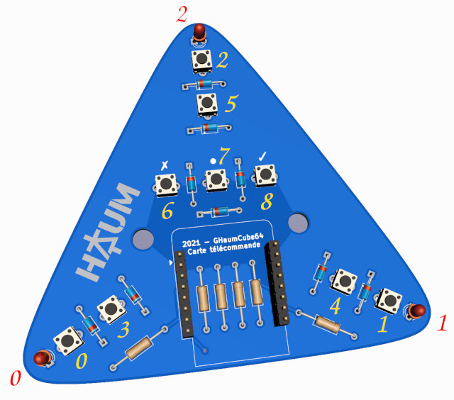

Protocoles
==========

Cube
----

Le cube est piloté via le protocole sACN (ou E1.31), un standard de contrôle populaire dans le milieu du spectacle. Il permet de piloter des éclairages (couleur, position de miroir, choix de gobo, ouverture d'iris, etc.) voire d'autres appareils comme des pompes de machine à fumée.

Chaque élément à piloter peut recevoir une valeur de 8 bits sur un `canal`. Un même appareil peut consommer plusieurs canaux s'il a besoin de plusieurs valeurs. Lorsqu'il y a plus de 512 canaux dans une installation (c'est le cas ici), les données sont réparties sur plusieurs `univers`.

.. note::

   Il est conseillé d'utiliser une bibliothèque déjà existante pour communiquer avec le cube.

Dans le cube, les canaux sont utilisés pour définir l'intensité de chaque couleur dans les leds de celui-ci.

 - Chaque led consomme 3 canaux pour les intensités des couleurs rouge, vert et bleu.
 - Chaque tål est constitué de 3 leds (donc 9 canaux)
 - Les canaux sont contigüs et répartis sur deux univers (576 canaux, répartis sur l'ensemble de l'univers 1 et les premiers canaux de l'univers 2)

Par exemple, le canal 11 de l'univers 1 définit l'intensité de la couleur verte de la led 4 (qui est située dans le tål 2).

La position spaciale des leds et tåls est à relever vous-même sur la structure.


Télécommandes
-------------

Généralités
```````````

Le protocole a été développé spécialement pour l'évènement. Chaque télécommande dispose d'un port TCP 540 ouvert en écoute. Un seul client peut être connecté à la fois (une nouvelle connexion déconnecte l'ancien utilisateur). La communication a lieu en mode textuel avec une valeur par ligne. La mention "24HC21 remote" est envoyée à la connexion.



Boutons
```````

À chaque changement d'état des boutons, une ligne est envoyée sur la liaison TCP avec une valeur numérique.

Chaque bit de cette valeur correspond à l'état d'un bouton. Par exemple, la valeur 322 est envoyée lorsque les boutons 8, 6 et 1 sont pressés simultanément (``322 = 2^8 + 2^6 + 2^1``).

Leds
````

La télécommande interprète les nombres envoyés sur la liaison TCP. Lorsque ceux-ci sont compris entre 0 et 7 inclus, elle allume ses leds en considérant les bits de la valeur. Par exemple, lorsque la valeur est 6, elle allume ses leds 1 et 2 (``6 = 2^2 + 2^1``).
